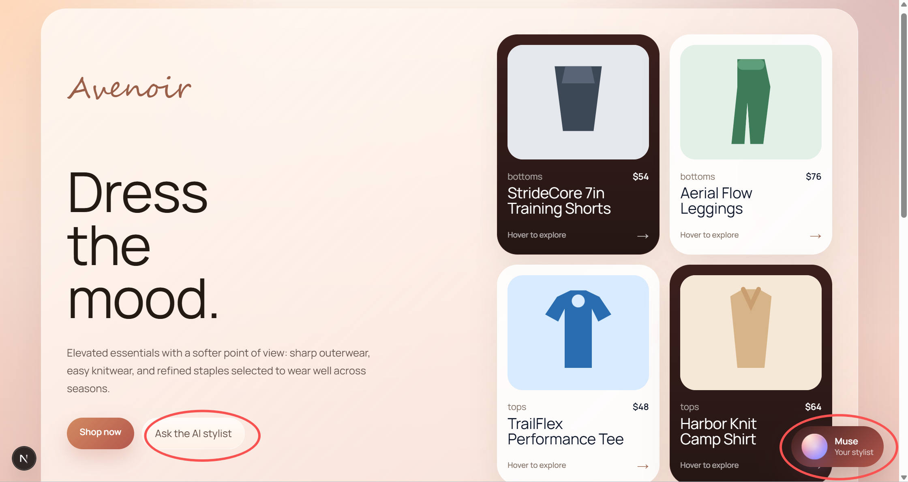
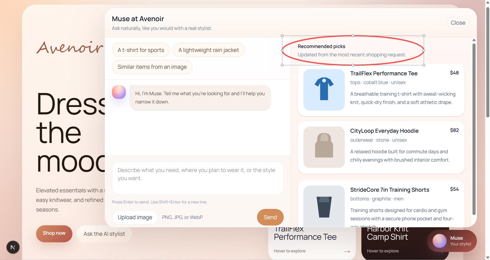
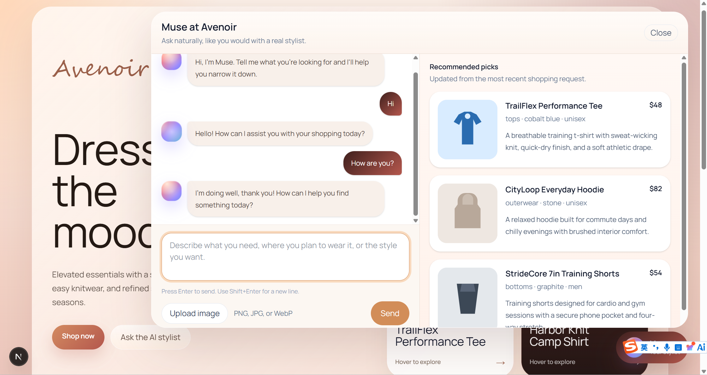
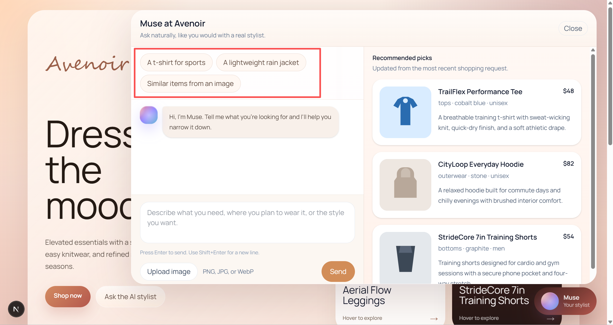
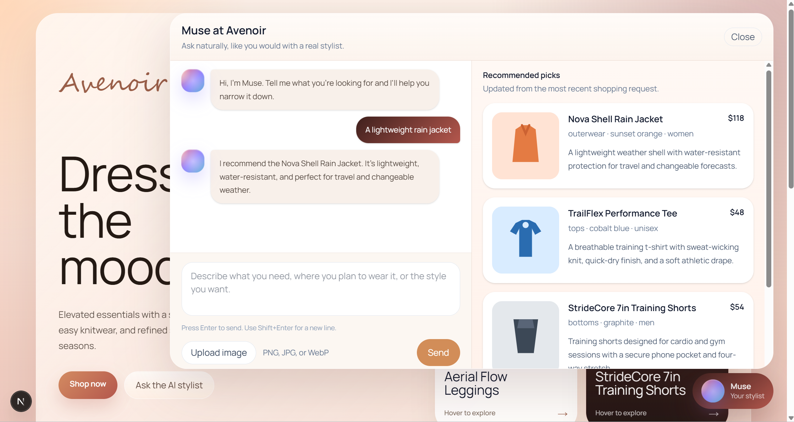
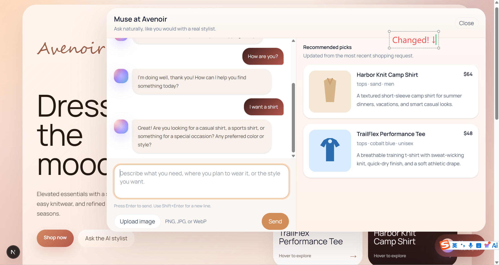
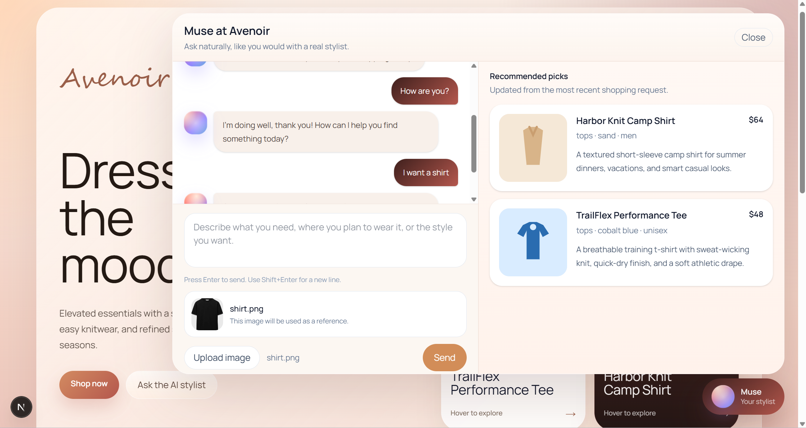
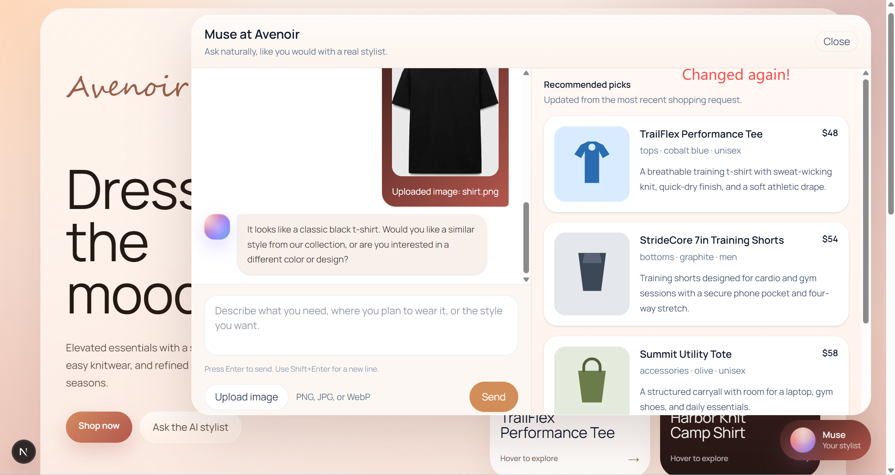

# Avenoir Commerce Agent

A take-home implementation of a single AI shopping agent for a commerce website.

This project is built around one assistant, `Muse`, that handles all three required use cases in the same experience:

- General conversation
- Text-based product recommendation
- Image-based product search

The storefront is presented as a fictional fashion brand, `Avenoir`, with a predefined catalog. Rather than making the entire page a chatbot, the agent is embedded as a floating assistant in the bottom-right corner so shopping remains the primary experience and AI remains an assistive layer.

## Overview

`Muse` is designed to feel like a shopping assistant rather than a support bot.

The interaction model is:

- The user lands on a storefront first, not a chat-first UI
- The floating `Muse` button opens a shopping assistant panel
- The left side of the panel is the conversation
- The right side is a recommendation rail that reacts to shopping-related prompts
- The recommendation rail is intentionally stable: casual messages like `Hi` or `How are you?` do not wipe out the last useful set of product recommendations

This was a deliberate UX decision so the experience feels closer to a real commerce assistant and less like a demo that refreshes on every sentence.

## Experience walkthrough

### Storefront

The landing page is a lightweight fashion storefront for `Avenoir`, a fictional demo brand created for this exercise, with curated sections and a visible catalog. The goal is to make the product context legible before the user ever opens the AI.

### Muse assistant

`Muse` lives in the bottom-right corner as a floating entry point. Clicking the button opens a shopping panel.

Inside the assistant:

- The conversation stays on the left
- Product results stay on the right
- The user can type naturally, press `Enter` to send, or upload an image
- Uploaded images appear directly inside the chat thread
- The chat auto-scrolls as new messages arrive

### Recommendation behavior

The recommendation rail is intentionally tied to shopping intent, not every message.

- A greeting should trigger a greeting back
- A shopping request should update recommendations
- A follow-up preference such as `more casual`, `warmer`, or `I like pink` should refine the shopping context
- If a requested item does not exist in the catalog, the assistant should say so and suggest the nearest alternatives

This prevents the UX from feeling random or overly reactive.

## Demo assets

If reviewing this repository through GitHub only, the screenshots below show the intended interaction model without requiring a local run.

## Demo

Video walkthrough:
[Watch the demo on YouTube](https://youtu.be/r6iBArBdHIU)

### 1. Entry point for the AI assistant



`Muse` is available from two entry points: the floating assistant button in the bottom-right corner and the `Ask the AI stylist` CTA in the hero area.

### 2. Conversation and recommendations live side by side



When the panel opens, the conversation stays on the left and the recommendation rail stays on the right so users can talk to the assistant without losing product context.

### 3. General conversation works like a natural assistant



`Muse` can handle casual greetings and small talk, so the interaction starts like a normal assistant rather than a rigid search form.

### 4. Sample prompts help the user get started quickly



The assistant opens with a few example prompts so first-time users do not need to guess what kinds of requests work well.

### 5. Following a sample prompt updates the recommendation rail



Clicking one of the suggested prompts immediately turns the assistant into a shopping flow and updates the product rail with relevant catalog matches.

### 6. Text-based product recommendation updates the product rail



When the user makes a shopping request, the recommendation rail updates to reflect the latest shopping intent.

### 7. Image upload is visible inside the chat flow



The uploaded reference image is shown directly in the conversation so the user can see exactly what the assistant is using before submitting the request.

### 8. Image-based product search updates recommendations



After an image is submitted, the assistant describes the visual cue and updates the recommendation rail with the closest matches from the predefined catalog.

## What is implemented

- A storefront landing page with curated product sections
- A floating AI shopping assistant (`Muse`)
- One unified `POST /api/chat` endpoint
- General conversational responses
- Text-based product recommendations grounded to the catalog
- Image upload plus image-based catalog matching
- Recommendation panel that updates alongside the conversation

## Tech stack

- Next.js App Router
- TypeScript
- Tailwind CSS
- Local in-memory catalog
- OpenAI Responses API

## Why this UX direction

I intentionally avoided a full-page chatbot because that usually makes the shopping experience feel secondary. In a real commerce setting, users often want to browse first and ask for help only when needed.

That led to three product choices:

- `Muse` is opened through a floating button rather than dominating the homepage
- The storefront remains visible and usable on its own
- Recommendations are shown alongside the conversation so the assistant feels connected to products rather than acting like a disconnected chat demo

## Architecture

The exercise specifically asks for a single agent that can handle multiple use cases. To keep that requirement explicit, the app uses one orchestration layer and one API route:

- [`src/app/api/chat/route.ts`](/C:/Users/lyhsd/Documents/New%20project/commerce-agent/src/app/api/chat/route.ts): request entry point
- [`src/lib/agent.ts`](/C:/Users/lyhsd/Documents/New%20project/commerce-agent/src/lib/agent.ts): single-agent orchestration and OpenAI call
- [`src/lib/search.ts`](/C:/Users/lyhsd/Documents/New%20project/commerce-agent/src/lib/search.ts): catalog ranking helpers
- [`src/data/catalog.ts`](/C:/Users/lyhsd/Documents/New%20project/commerce-agent/src/data/catalog.ts): predefined product catalog
- [`src/components/commerce-agent.tsx`](/C:/Users/lyhsd/Documents/New%20project/commerce-agent/src/components/commerce-agent.tsx): assistant UI

The assistant is grounded to a fixed catalog so it cannot invent products outside the store inventory. If an item is not available, it should say so and propose the closest alternatives.

## Notable implementation details

- `Muse` uses one unified backend flow instead of separate bots for chat, recommendations, and image search
- The assistant is catalog-grounded, so recommendations stay within predefined inventory
- The conversation and recommendation rail are linked, but the recommendation rail only updates when the message is meaningfully shopping-related
- Image uploads are shown in the chat thread for transparency
- The chat panel auto-scrolls, which improves both usability and demo recording quality

## Feature coverage

### 1. General conversation

The assistant can greet the user, answer light conversational prompts, and continue into shopping assistance naturally.

Examples:

- `Hi`
- `How are you?`
- `What can you do?`

### 2. Text-based recommendation

The assistant can interpret requests such as:

- `I need a lightweight jacket for travel`
- `Recommend a t-shirt for sports`
- `I want something casual but still polished`

It responds conversationally and keeps recommendations constrained to the catalog.

### 3. Image-based product search

The user can upload an image and ask for similar items. The uploaded image appears in the conversation, and the recommendation panel updates based on the image plus the latest prompt.

## API

### `POST /api/chat`

Example request:

```json
{
  "messages": [
    { "role": "user", "content": "I need a lightweight jacket for travel" }
  ],
  "input": "I need a lightweight jacket for travel",
  "imageDataUrl": "data:image/png;base64,...",
  "imageName": "reference-look.png"
}
```

Example response:

```json
{
  "mode": "text_recommendation",
  "answer": "A few good options stand out for travel and light layering...",
  "recommendations": [
    {
      "id": "nova-shell-jacket",
      "name": "Nova Shell Rain Jacket",
      "category": "outerwear",
      "price": 118,
      "color": "sunset orange",
      "audience": "women",
      "image": "/products/nova-shell-jacket.svg",
      "description": "A lightweight weather shell with water-resistant protection for travel and changeable forecasts.",
      "tags": ["jacket", "rain", "orange", "travel", "womens", "lightweight"],
      "attributes": ["packable", "water resistant", "drawcord hem"]
    }
  ],
  "imageSummary": "",
  "usedModel": true,
  "runtime": "openai"
}
```

## Running locally

Install dependencies:

```bash
npm install
```

Start the dev server on port `3001`:

```bash
npm run dev -- --port 3001
```

Open [http://localhost:3001](http://localhost:3001).

## Reviewer quick start

If you want to review the project quickly:

1. Install [Node.js](https://nodejs.org/)
2. Open a terminal in this project folder
3. Run `npm install`
4. Create a file named `.env.local`
5. Add your OpenAI API key:

```bash
OPENAI_API_KEY=your_key_here
```

6. Run `npm run dev -- --port 3001`
7. Open [http://localhost:3001](http://localhost:3001)
8. Try:
   - `Hi`
   - `I need a lightweight jacket for travel`
   - `I want something more polished`
   - `I want a skirt`
   - Upload an image and ask `Find something similar`

## Environment variables

Create a `.env.local` file:

```bash
OPENAI_API_KEY=your_key_here
```

This project is intended to run with a valid OpenAI API key because the final chat flow uses the model directly.

## Why this is not publicly deployed

I chose not to leave a public hosted version online because the assistant uses a live OpenAI API key. For a take-home submission, a public deployment without authentication, usage limits, or rate limiting would create unnecessary cost and abuse risk.

The project is ready to run locally and can be reviewed safely from source with reproducible setup instructions.

## Design decisions

- The storefront is a fashion retail concept rather than a bare chatbot page so the agent feels embedded in a realistic commerce context.
- The assistant opens as a floating panel to keep browsing primary and AI help secondary.
- The recommendation panel stays visible beside the conversation so the user can see product results update in real time.
- The assistant responds conversationally, but recommendation updates are reserved for shopping-related prompts so the product rail remains useful.
- Product inventory is intentionally small and predefined to match the exercise requirement and keep evaluation predictable.

## Tradeoffs

- The catalog is small and synthetic, so recommendation breadth is intentionally limited.
- There is no user authentication, persistence layer, or production rate limiting.
- The current demo uses a single local catalog rather than a database-backed product system.
- The current implementation is optimized for take-home clarity and demo reliability rather than full production hardening.

## Suggested demo prompts

- `Hi`
- `Recommend a hoodie for everyday wear`
- `I want something more polished`
- `I want a skirt`
- Upload an image and ask: `Find something similar`
